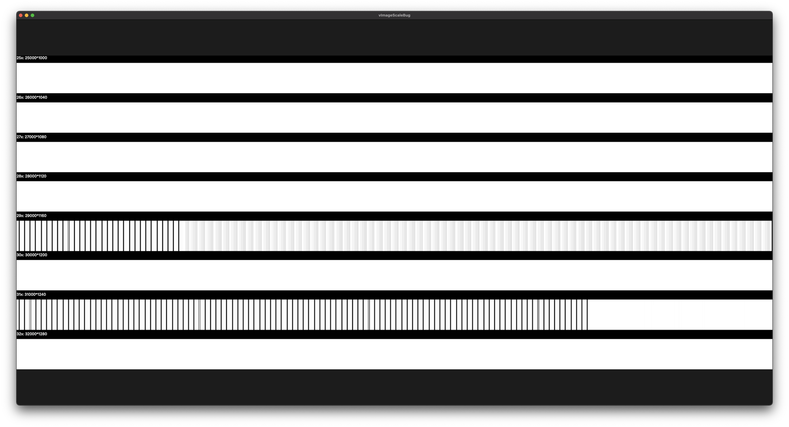

# vImageScaleBug
A bug in [vImageScale](https://developer.apple.com/documentation/accelerate/vimage/vimage_operations/image_scaling) results in empty columns in output images. It only happens when the output image is excessively large (29000+px). Every time you run the sample app it produces a different result.

## Requirements
- Xcode 12.0+
- iOS 14.0+

## Screenshot

